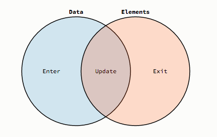

# selections

多选

```js
d3.selectAll("p").style("color", "white");
```

单选

```js
d3.select("body").style("background-color", "black");
```


# Dynamic Properties

```js
d3.selectAll("p").style("color", function() {
  return "hsl(" + Math.random() * 360 + ",100%,50%)";
});
```

```js
d3.selectAll("p").style("color", function(d, i) {
  return i % 2 ? "#fff" : "#eee";
});
```

d是第i个节点上绑定的数据。

```js
d3.selectAll("p")
    .data([4, 8, 15, 16, 23, 42])
    .style("font-size", function(d) { return d + "px"; });
```


# append()添加元素

```js
var body = d3.select("body");
var div = body.append("div");
div.html("Hello, world!");
```

```js
var section = d3.selectAll("section");
var div = section.append("div");
div.html("Hello, world!");
```

Note: append() returns a new selection containing the new elements.(chaining methods)

# 通过数据来生成元素

```js
d3.select(".chart")
  .selectAll("div")
    .data(data)
  .enter().append("div")
    .style("width", function(d) { return d * 10 + "px"; })
    .text(function(d) { return d; });
```


# Enter Update Exit



Enter用于创建新的节点

```js
d3.select("body").selectAll("p")
    .data([4, 8, 15, 16, 23, 42])
  .enter().append("p")
    .text(function(d) { return "I’m number " + d + "!"; });
```

data有6个元素，如果p没有6个，那么enter()指代的就是没有数据的新创建的节点。

data()的结果就是选中了那些已匹配的节点。

```js
// Update…
var p = d3.select("body").selectAll("p")
    .data([4, 8, 15, 16, 23, 42])
    .text(function(d) { return d; });

// Enter…
p.enter().append("p")
    .text(function(d) { return d; });

// Exit…
p.exit().remove();
```

Exit用于删除节点，就是p的个数比data还多，就把多的删除掉。

## 用法1：

比如条形图，初始化时使用的是缩放比1，然后data添加了一些新的数据，此时就可以用enter()选中新的数据使用缩放比2.

## 当在enter()后添加了元素后,新增的元素同样会反映在update集合中

```js
  // DATA JOIN
  // Join new data with old elements, if any.
  var text = svg.selectAll("text")
      .data(data);

  // UPDATE
  // Update old elements as needed.
  text.attr("class", "update");

  // ENTER
  // Create new elements as needed.
  text.enter().append("text")
      .attr("class", "enter")
      .attr("x", function(d, i) { return i * 32; })
      .attr("dy", ".35em");

  // ENTER + UPDATE
  // Appending to the enter selection expands the update selection to include
  // entering elements; so, operations on the update selection after appending to
  // the enter selection will apply to both entering and updating nodes.
  text.text(function(d) { return d; });

  // EXIT
  // Remove old elements as needed.
  text.exit().remove();
```

## data()的第二个参数

没有第二个参数的情况下:

```js
data(data1)
data(data2)
```

被比较的两个元素是使用下标选出来的:data1[i] =? data2[i]

如果data2中元素的顺序发生了变化(比如对data2排序), 在执行 `data(data2)` 时原本已经存在的元素就跑到了enter()集合中.

有第二个参数的情况下:

```js
data(data1, function(d) {return d.id;})
data(data2, function(d) {return d.id;})
```

此时相互比较的两个元素就根据id来获取,而不是下标.

具体例子参考 bar_data_key.html 的例子.


# Transition

```js
d3.select("body").transition()
    .style("background-color", "black");
```

```js
d3.selectAll("circle").transition()
    .duration(750)
    .delay(function(d, i) { return i * 10; })
    .attr("r", function(d) { return Math.sqrt(d * scale); });
```

## 时间监听

```js
	d3.select('#test').transition()
			.delay(2000)
			.duration(5000)
			.each('start', function () {
				d3.select(this).style('color', 'green');
			})
			.style('color', 'red');
```


# 坐标系统

The origin of SVG’s coordinate system is in the top-left corner.

